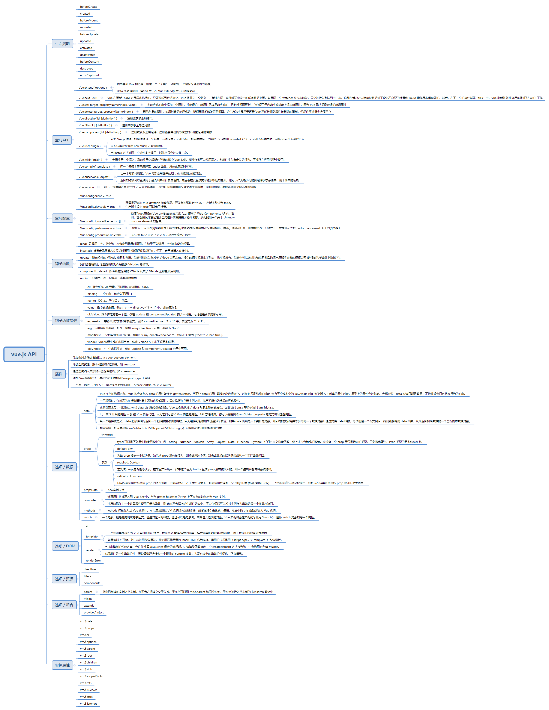

## 开始Vue的历程👉（提示：正在更新中 ⛅）
学习Vue,我是在18年，那时候我是被Vue的书写简单，结构清晰所吸引。后来了解到它可以解耦前端视图和数据，组件化复用，状态管理，虚拟dom等等。正如《深入浅出Vue.js》提到的，Vue的核心库和生态系统可以满足我们的各种需求。它是一个渐进式框架，我们可以使用它的一部分或更多。
随着不断学习，开始接触源码，才发现之前的理解过于肤浅，因此想不断积累vue的相关知识。
## 做项目从中接触到了什么?👉（提示：正在更新中 ⛅）

### Vue API
- 之前学习Vue的时候，看官网整理的，有需要的可以自己下载，支持去Vue.js文档去看。

[下载思维导图](./vue.jsAPI.xmind)
## 学习Vue的建议👉
- 1.如果你没有看javaScript，建议学习一下，可以看一下菜鸟教程，W3C,或者技术博客
- 2.初次接触Vue可以看一下Vue官方文档，看一下菜鸟教程的Vue，书本学习也可以看一下《Vue.js实战》这本书
- 3.创建Vue项目，在开发中遇到问题不断解决它，积累它，当对Vue用的很熟悉时，就想去深层的了解它
- 4.推荐《深入浅出Vue.js》这本书，它会让你更了解Vue
- 5.可以在github上下载Vue的源码进行分析，了解作者的设计思路，学习优秀的经验，推荐min-Vue这个项目去简单了解
- 6.如果已经对它“知根知底”，可以在Vue的github上回答各种issue，同时优化改进运用到自己的项目中
## 我要做什么呢👉
我想把和Vue有关的知识点做一个积累。这些知识点可能是我在书中所看，可能是遇到的问题，也可能是在网上所看的，等等。所以我的项目名称是VueSummary。我会不定时的更新目录，欢迎志同道合的人加入，一起努力！
### 周进度
| 时间| 主要内容 | 简介 |
|  ----  |  ----  | ----  |
| 2021.03.26 | [vue的基础知识点](./vue/v1.md)更新中 | vue的基本知识 |
## 更新进度🏆
| 章节| 主要内容 | 时间 | 状态 | 简介 |
|  ----  |  ----  |  ----  |  ----  | ----  |
|Vue 主要知识点|[Vue 主要知识点](./vue/v1.md)|2021.03.15|更新中|介绍开发常见的知识点|
|Vue 常见问题|[Vue 常见问题](./vue/vq.md)|2021.03.26|更新中|常见开发遇到的问题|
|Vuex的简单梳理|[Vuex笔记](./vuex/vx.md)|2021.03.18|更新中||
|Vue的源码分析|[Vue的源码分析](./vueSouce/vs1.md)|2021.03.17|更新中||
|手写Vue的几个特性|[实现一个简单Vue](./vue/minVue.md)|2021.03.16|更新中||
## 欢迎给我的博客提建议
[我的博客](https://blog.pxbtf.com)
## 最后👉
祝愿2021年，大家身体健健康康，技术节节高升！