# vue源码分析
### 说明
- 目前是自己之前整理的内容，最近打算重新梳理一下这个内容，通过这段时间学习，有很多东西需要在此基础上填充，可以点个star,记录一下
- 时间：2021.03.16
### 目标
希望看完之后，对于想要研究vue源码的同学能够更优雅的学习vue源码 🍒
## 准备工作
 ## 认识flow
 - 静态模板检测工具 （facebook）
 - 检测方式
 - 声明好检测
 - 自己预测
 ## 看一下package.json
 - Karma: npm查了一下，用于在多个平台测试js代码
 - rollup：vue的构建工具
 - Uglify：简化js和css文件，将js压缩成min.js
 - zlib: zlib 是通用的压缩库，提供了一套 in-memory 压缩和解压函数，并能检测解压出来的数据的完整性(integrity)。zlib 也支持
 - 读写 gzip (.gz) 格式的文件
 - TARGET=weex-framework rollup -w -c build/config.js: 在同一个文件选择不同的脚本
 ```javaScript
//补充一些参数，添加一些参数
//遵循rollup构建规则
function genConfig (opts) {
  const config = {
    entry: opts.entry,
    dest: opts.dest,
    external: opts.external,
    format: opts.format,
    banner: opts.banner,
    moduleName: 'Vue',
    plugins: [
      replace({
        __WEEX__: !!opts.weex,
        __WEEX_VERSION__: weexVersion,
        __VERSION__: version
      }),
      flow(),
      buble(),
      alias(Object.assign({}, require('./alias'), opts.alias))
    ]
  }

  if (opts.env) {
    config.plugins.push(replace({
      'process.env.NODE_ENV': JSON.stringify(opts.env)
    }))
  }

  return config
}
if (process.env.TARGET) {
  module.exports = genConfig(builds[process.env.TARGET])//.导出build的字段
}
 ```
 ## 分析build.js
 - process.argv: 属性返回一个数组，这个数组包含了启动Node.js进程时的命令行参数
 - fs.mkdirAsync：同步创建文件
 - filter():返回一个新的数组，新数组中的元素是通过检查指定数组中符合条件的所有元素。
 - 🏹注意：filter() 不会对空数组进行检测，不会改变原始数组。
 - some() 方法用于检测数组中的元素是否满足指定条件（函数提供）。
 - some()方法会依次执行数组的每个元素：
 如果有一个元素满足条件，则表达式返回true , 剩余的元素不会再执行检测。
 如果没有满足条件的元素，则返回false。
 - slice(): 方法可从已有的数组中返回选定的元素
 ## 看alias.js
 ```javaScript
  vue: path.resolve(__dirname, '../src/entries/web-runtime-with-compiler'),
  compiler: path.resolve(__dirname, '../src/compiler'),
  core: path.resolve(__dirname, '../src/core'),
  shared: path.resolve(__dirname, '../src/shared'),
  web: path.resolve(__dirname, '../src/platforms/web'),
  weex: path.resolve(__dirname, '../src/platforms/weex'),
  server: path.resolve(__dirname, '../src/server'),
  entries: path.resolve(__dirname, '../src/entries'),
  sfc: path.resolve(__dirname, '../src/sfc')
 ```
 ## 确定入口
 ```javaScript
import { initMixin } from './init'
import { stateMixin } from './state'
import { renderMixin } from './render'
import { eventsMixin } from './events'
import { lifecycleMixin } from './lifecycle'
import { warn } from '../util/index'

function Vue (options) {
  if (process.env.NODE_ENV !== 'production' &&
    !(this instanceof Vue)) {
    warn('Vue is a constructor and should be called with the `new` keyword')
  }
  this._init(options)
}

initMixin(Vue)
stateMixin(Vue)
eventsMixin(Vue)
lifecycleMixin(Vue)
renderMixin(Vue)

export default Vue
 ```
 在src/core/indtance/index.js
- 由上面代码可知，vue 是一个构造函数，所有创建vue实例时用的是new
- 👮‍为什么没用class?
- 📕class一般在一类里实现所有方法，而上面代码是将vue放入不同的模块去扩展，因此用class实现麻烦。这个思想可以借鉴
- 在src/core/index.js
```javaScript
import Vue from './instance/index'
import { initGlobalAPI } from './global-api/index'
import { isServerRendering } from 'core/util/env'

initGlobalAPI(Vue)

Object.defineProperty(Vue.prototype, '$isServer', {
  get: isServerRendering
})

Vue.version = '__VERSION__'

export default Vue
```
- initGlobalAPI ：初识化api
### 待更新。。。
## Vue源码解析之入口文件

- 根据package.json找到入口文件

- /entry-runtime-with-compiler.js
- Runtime/index.js
- core/index.js
- 初始化全局变量
- Core/instance/index.js
- Vue 构造函数


 给Vue.property扩展一些方法
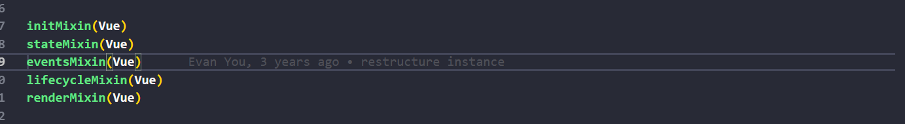
⏰提示：Vue 不使用class类，而是将这些扩展分散到模块中，便于管理
- /core/globel-api/index.js
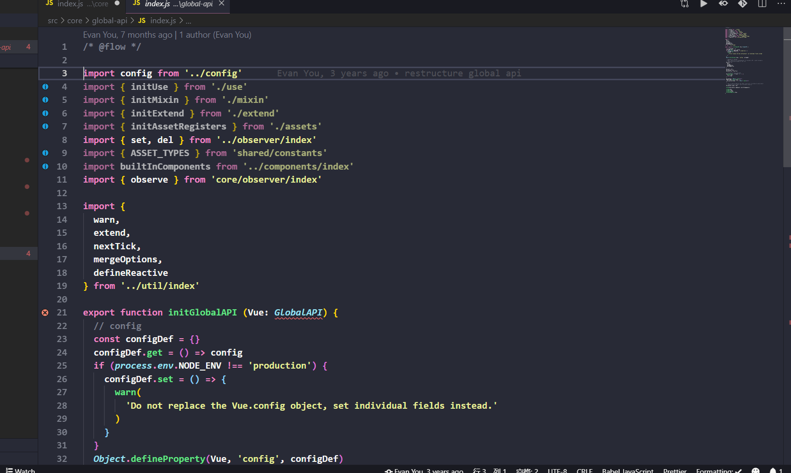
- extend nextTick mergeOptions defineReactive
- Vue.util暴露的方法最好不要依赖，因为它经常发生变化 ，是不稳定的。
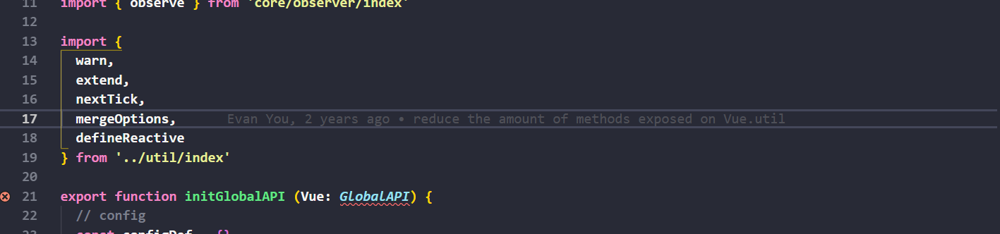
## Vue源码解析之数据驱动
- 目标：弄清楚模板和数据如何渲染成最终的 DOM。
- 🤔new Vue()都发生了什么？
- 1.调用this_init()
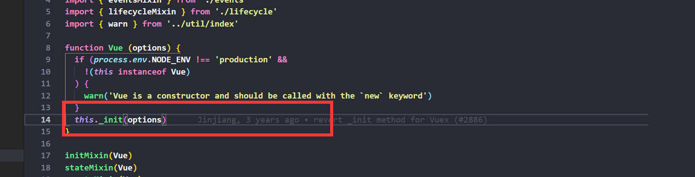
- core/instance/init.js
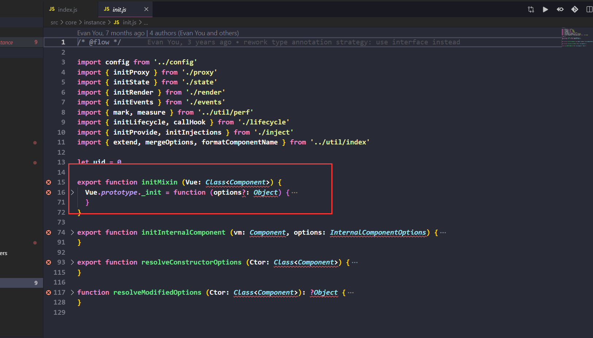
- uid
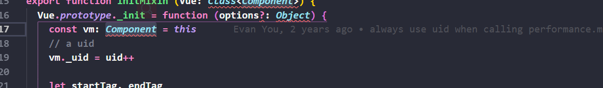
- vm的属性扩展
- initLifecycle初始化生命周期
- initEvent初始化事件
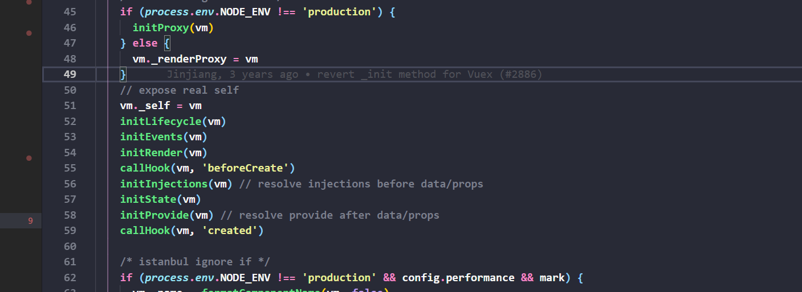
- el $mount
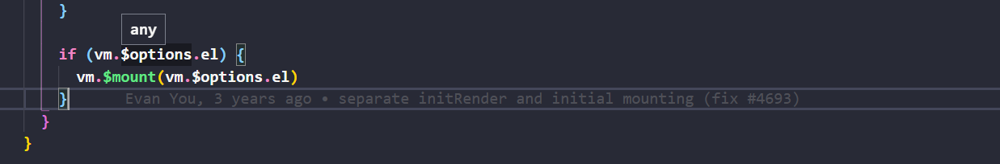
- 总结:调用this_init(),在core/instance/init.js中加uid,初始化各种内容，判断el,进行$mount
## Vue源码解析之实例挂载的实现
- src/platform/web/entry-runtime-with-compiler.js 
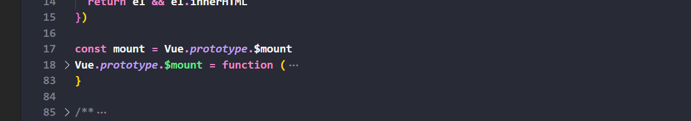
- body html 排除
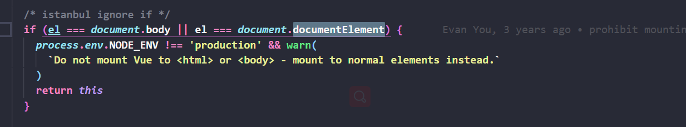
- 判断render
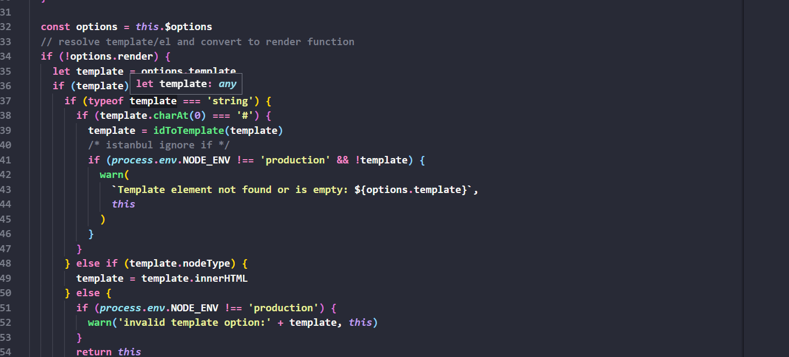
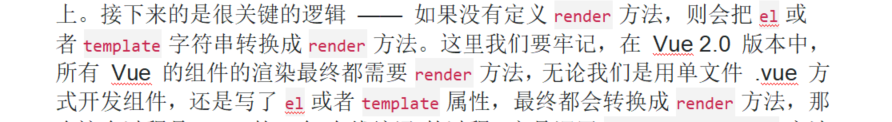
- 调用compileToFunction

- core/instance/lifecycle.js
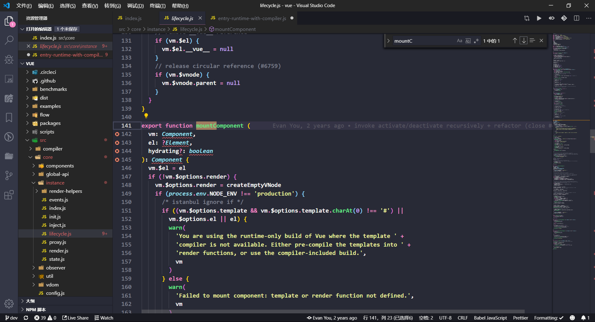
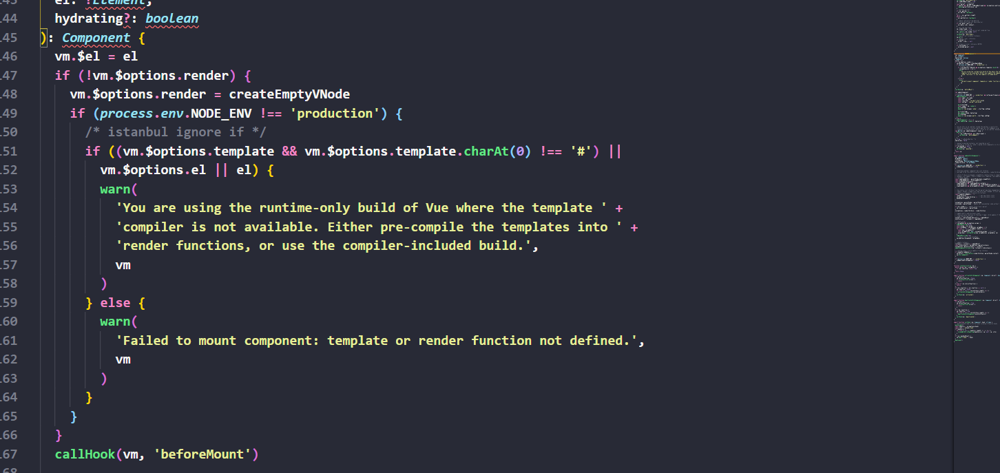
## Vue源码解析之createElement
- src/core/vdom/create-elemenet.js
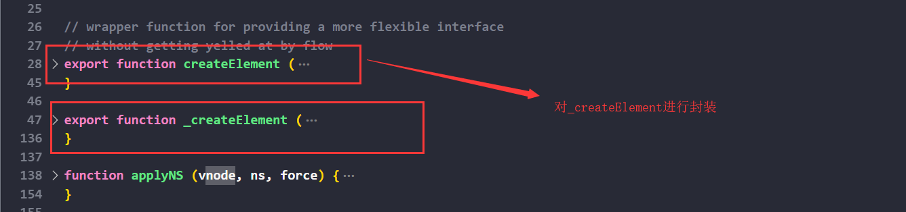
- 内容：
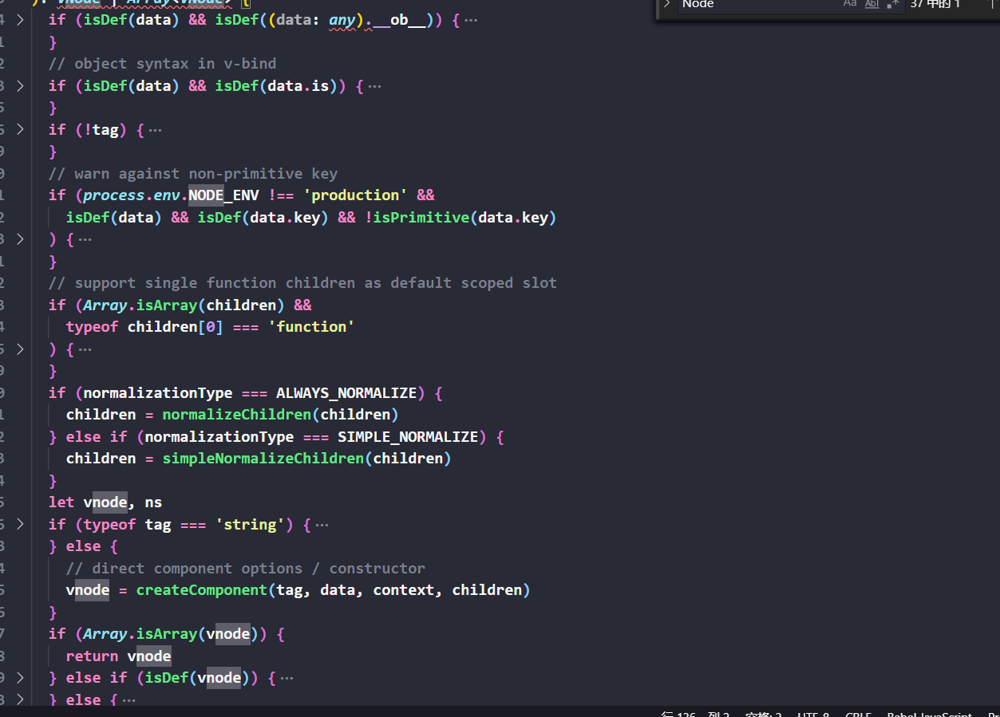
- 这里根据 normalizationType 的不同，调用了 normalizeChildren(children) 和 simpleNormalizeChildren(children) 方法，将children的任意类型转换成VNode类型 
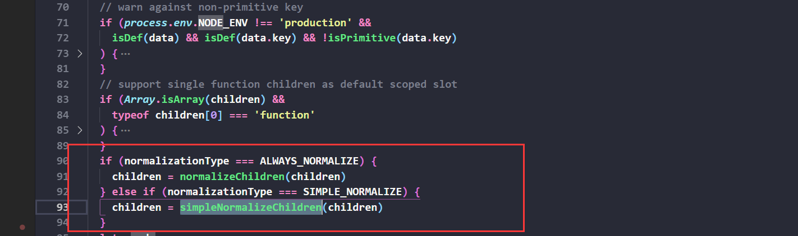
- simpleNormalizeChildren 是模板编译，本身就是VNode模型
## vue源码解析之render渲染函数
- core/instance/render.js
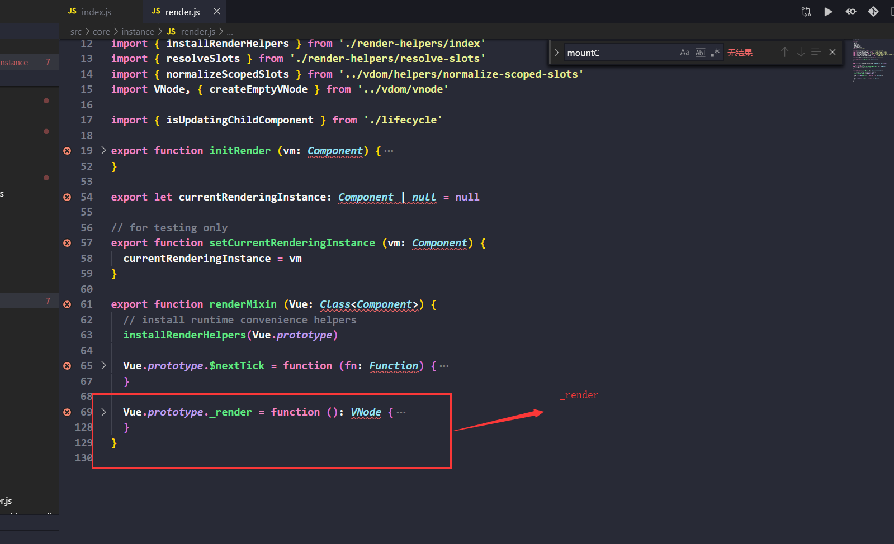
- vm._c----> createElement 模板渲染
- vm.createElement------>createElement 手写render方法被调用

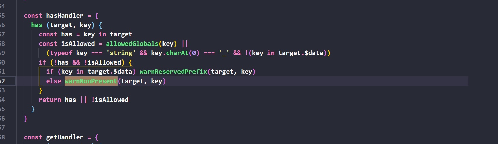
- 总结：判断有无render，getHandler hasHanler
## vue源码分析之vdom
- src/core/vdom/vnode.js
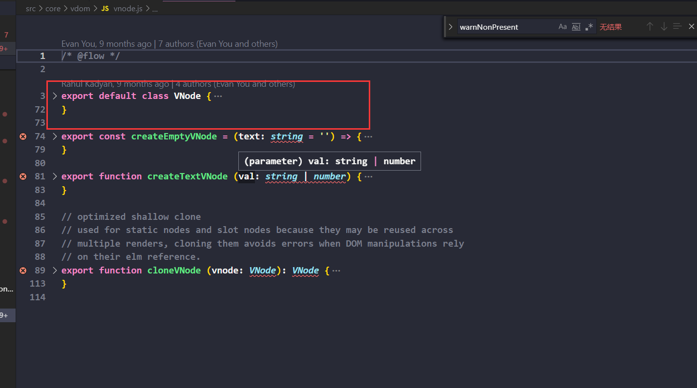
借鉴[snabbdom](https://github.com/snabbdom/snabbdom)，添加Vue.js自己的特色。
- vdom 要经历create diff patch 等过程，其中create是createElement